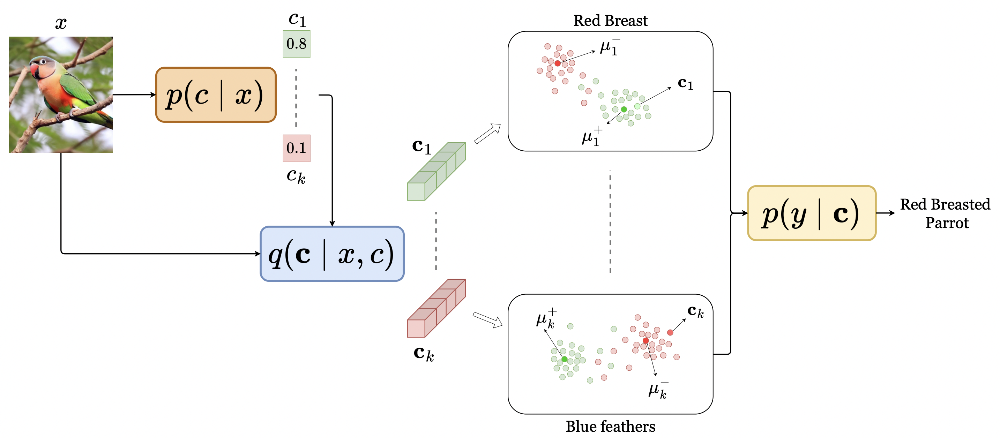

# Variational Concept Embedding Model (V-CEM)

This repository contains the official implementation to reproduce the experiments in the paper:  
**"V-CEM: Bridging Performance and Intervenability in Concept-based Models"**  
Published at **The 3rd World Conference on eXplainable Artificial Intelligence**, 2025.

## 📝 TLDR
Concept-based eXplainable AI (C-XAI) improves model interpretability by using human-understandable concepts, enabling transparency and user intervention. Concept Bottleneck Models (CBMs) allow intervention by explicitly predicting concepts but underperform compared to black-box models. Concept Embedding Models (CEMs) improve in-distribution (ID) accuracy by learning from inputs and concept predictions but are less effective for intervention, especially out-of-distribution (OOD). We introduce the Variational Concept Embedding Model (V-CEM), which uses variational inference to boost intervention responsiveness. Evaluated across textual and visual datasets, V-CEM maintains CEM-level ID accuracy and matches CBM intervention performance in OOD, narrowing the gap between interpretability and generalization.



## 🧪 Reproducing the Experiments

To execute the code, please follow the detailed steps outlined below:

1. **Create the virtual environment:**
   First, you need to set up the virtual environment using the provided `environment.yml` file. This can be done by running the following command:
   ```sh
   conda env create -f environment.yml
   ```

2. **Activate the environment:**
   Once the virtual environment is created, you need to activate it. Use the command below to activate the environment named `v_cem`:
   ```sh
   conda activate v_cem
   ```

3. **Run the experiments:**
   With the environment activated, you can now run the experiments by executing the main script. Use the following command to start the experiments:
   ```sh
   python main.py
   ```

## Citation
<pre>@article{de2025v,
   title={V-CEM: Bridging Performance and Intervenability in Concept-based Models},
   author={De Santis, Francesco and Ciravegna, Gabriele and Bich, Philippe and Giordano, Danilo and Cerquitelli, Tania},
   journal={arXiv preprint arXiv:2504.03978},
   year={2025}
}</pre>


